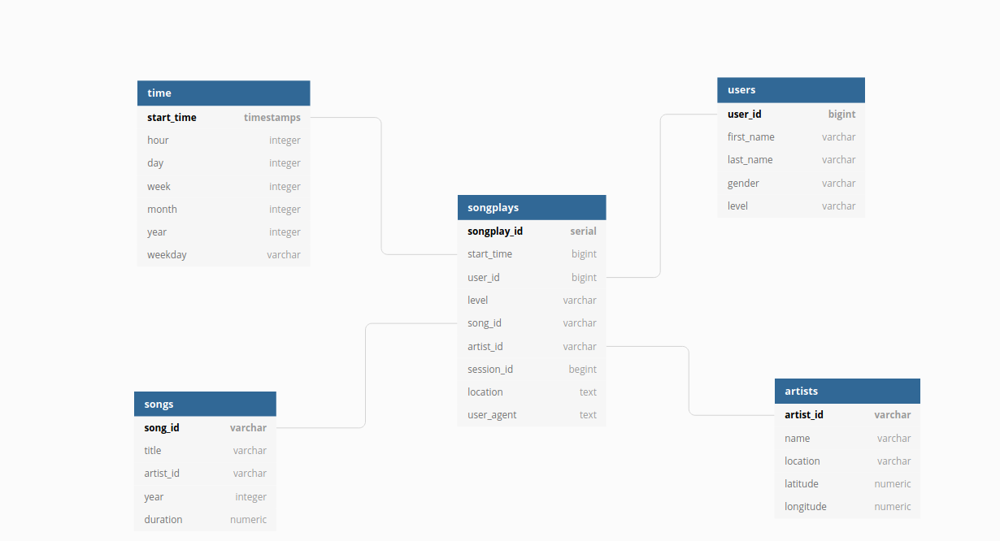

##### Udacity Data Engineering Nanodegree


</br>
</br>
</br>

# Project 1 : Data Modeling with Postgres 

About an ETL, collecting .json files, and organizing the database in star schemas

### Table of contents

   - [About the project](#about-the-project)
   - [Purpose](#purpose)
   - [Getting started](#getting-started)
   - [Ressources](#ressources)
       - [Dataset SongData](#dataset-songdata)
       - [Dataset LogData](#dataset-logdata)
       - [Schema for song play analysis](#schema-for-song-play-analysis)
       - [Tools and Files](#tools-and-files)
   - [Worflow](#worflow)
      - [Create the tables](#create-the-tables)
      - [Build ETL process](#build-etl-process)
      - [Run ETL pipeline](#run-etl-pipeline)
      - [Document process](#document-process)
   - [Workspace](#workspace)
      - [My environnemets](#my-environements)
      - [Discuss about the databases](#discuss-about-the-database)
      - [Erd](#erd)
      - [Queries](#queries)
      - [Weblinks](#web-links)
  - [TODO](#todo)

<!--CACHER-->


## About the project

A startup called Sparkify wants to analyze the data they've been collecting on songs and user activity on their new music streaming app. The analytics team is particularly interested in understanding what songs users are listening to. Currently, they don't have an easy way to query their data, which resides in a directory of JSON logs on user activity on the app, as well as a directory with JSON metadata on the songs in their app.

They'd like a data engineer to create a Postgres database with tables designed to optimize queries on song play analysis.
* Create a Postgres database
* Insert data in the Sparkify database
* Test the database
* Test ETL pipeline with team analytic's queries
* Compare the results with their expected results

## Purpose

The purpose of this project is to apply data modeling with Postgres and build an ETL pipeline using Python.   
We will need to:
* define fact and dimension tables for a star schema for a particular analytic focus
* write an ETL pipeline that transfers data from files in two local directories into these tables.
  
## Getting started

  * to restart the database and clear the database, run `create_tables.py`
  * run the Etl with `etl.py`
  * see the output with `test.ipynb`
  * Becareful, restart `test.ipynb` just after his run and be sure that `etl.ipynb` is `conn.close()`!!

  

## Ressources
  
###  Dataset SongData
Subset of real data from the Million Song Dataset. Each file is in JSON format and contains metadata about a song and the artist of that song. The files are partitioned by the first three letters of each song's track ID. For example, here are filepaths to two files in this dataset.  

```python
song_data/A/B/C/TRABCEI128F424C983.json
song_data/A/A/B/TRAABJL12903CDCF1A.json
```
And below is an example of what a single song file, TRAABJL12903CDCF1A.json, looks like.

```python
{"num_songs": 1, "artist_id": "ARJIE2Y1187B994AB7", "artist_latitude": null, "artist_longitude": null, "artist_location": "", "artist_name": "Line Renaud", "song_id": "SOUPIRU12A6D4FA1E1", "title": "Der Kleine Dompfaff", "duration": 152.92036, "year": 0}
```

### Dataset LogData
Log files in JSON format generated by this event simulator based on the songs in the dataset above. These simulate activity logs from a music streaming app based on specified configurations.

The log files are partitioned by year and month. For example, here are filepaths to two files in this dataset.

```python
log_data/2018/11/2018-11-12-events.json
log_data/2018/11/2018-11-13-events.json
```
And below is an example of what the data in a log file, 2018-11-12-events.json, looks like.


If you would like to look at the JSON data within log_data files, you will need to create a pandas dataframe to read the data.

```
import json
df = pd.read_json(filepath, lines=True)
```

For example, 
```
import json
df = pd.read_json('data/log_data/2018/11 2018-11-01-events.json', lines=True) would read the data file 2018-11-01-events.json.
```
In case you need a refresher on JSON file formats, [here is a helpful video](https://www.youtube.com/watch?time_continue=1&v=hO2CayzZBoA). 

### Schema for song play analysis
Using the song and log datasets, you'll need to create a star schema optimized for queries on song play analysis. This includes the following tables.  

***Fact Table***

`songplays` - records in log data associated with song plays i.e. records with page `NextSong`   
* songplay_id, start_time, user_id, level, song_id, artist_id, session_id, location, user_agent

***Dimension Tables***

`users` - users in the app
  * user_id, first_name, last_name, gender, level  
  
`songs` - songs in music database
  * song_id, title, artist_id, year, duration  

`artists` - artists in music database  
  * artist_id, name, location, latitude, longitude  

`time` - timestamps of records in songplays broken down into specific units
 * start_time, hour, day, week, month, year, weekday

### Tools and Files
To get started with the project, go to the workspace, where you'll find the project template files. Alternatively, you can download the project template files from the Resources folder if you'd like to develop your project locally.

In addition to the data files, the project workspace includes six files:

`test.ipynb` displays the first few rows of each table to let you check your database.  
`create_tables.py` drops and creates your tables. You run this file to reset your tables before each time you run your ETL scripts.  
`etl.ipynb` reads and processes a single file from song_data and log_data and loads the data into your tables. This notebook contains detailed instructions on the ETL process for each of the tables.  
`etl.py` reads and processes files from song_data and log_data and loads them into your tables. You can fill this out based on your work in the ETL notebook.  
`sql_queries.py` contains all your sql queries, and is imported into the last three files above.  
`README.md` provides discussion on your project.


## Worflow

### Create the tables
* `Create Tables`: Write CREATE statements in `sql_queries.py`to create each table.  
* Write `DROP` statements in `sql_queries.py` to drop each table if it exists.
* Run  `create_tables.py` to create database and tables.
Run `test.ipynb` to confirm the creation of tables with the correct columns. Make sure to click "Restart kernel" to close the connection to the database after running this notebook.

### Build ETL process
Follow instructions in the `etl.ipynb` notebook. At the end of each table section, or at the end of the notebook, run `test.ipynb` to confirm that records were successfully inserted into each table. Remember to rerun `create_tables.py` to reset tables before each time you run this notebook.

### Run ETL pipeline
Use `etl.ipynb` to complete `etl.py`. Run `create_tables.py` before running `etl.py` to reset tables. Run `test.ipynb` to confirm records were successfully inserted into each table.

### Document Process
In the README.md file.  
* Discuss the purpose of this database in the context of the startup, Sparkify, and their analytical goals.
* State and justify database schema design and ETL pipeline.
* Provide example queries and results for song play analysis.s

## Workspace

#### My environements
I work with Jupyter Notebook and Spyder. So I 
* Installed Anaconda and Postgres on my laptop 
* Create a working environment in Anaconda called "psyco"
* in this environment I installed psycopg2 
* and the module in postgres "magic sql" for the test.ipyn Project1:  
  * `conda activate psyco`
  * `pip install sqlalchemy`
  * `pip install update sqlalchemy`
  * `pip install ipython-sql`

#### Discuss about the database
Before working with Postgres and queries, I explored datasets with Python.
I've noticed that the files can't match each other because there's no `songid` and `artistid` in common. I've explored them to find the ones that would match this criteria in another jupyter-notebook.

#### ERD

* I decide "varchar" for all none numerics values, except "text" for `user_agent` and in songplays table and `location` in both: it's a long string. `start_time` in songplays table will be in bigint because it's a timestamp with miliseconds. `start_time` will be a regular timestamp, formated in the process. `user_id` is bigint, I hope lot of users for Sparkify.
* `user_id`, `artist-id`, `song_id`, `start_time` become the primaries key of each dimension tables and `songplay_id` will be created by a serie.  

#### Queries
An example of a querie in `sql_queries.py`

```sql
artist_table_create = ("""CREATE TABLE IF NOT EXISTS artists 
                       (
                       PRIMARY KEY (artist_id),
                       artist_id varchar NOT NULL,
                       name varchar NOT NULL,
                       location text,
                       latitude numeric,
                       longitude numeric
                       )
""");
```
```sql
artist_table_insert = ("""
                       INSERT INTO artists (artist_id, name, location, latitude, longitude) 
                       VALUES (%s, %s, %s, %s, %s)
                       ON CONFLICT (artist_id)
                       DO UPDATE
                       SET name=EXCLUDED.name, location=EXCLUDED.location, latitude=EXCLUDED.latitude, longitude=EXCLUDED.longitude
                       """)
```
```sql
song_select = ("""
               SELECT songs.song_id, artists.artist_id
               FROM songs
               JOIN artists
               ON songs.artist_id = artists.artist_id
               WHERE songs.title = %s 
               AND artists.name = %s 
               AND songs.duration = %s
""");

```

#### Web Links 

[About `INSERT INTO UPDATE SET =excluted`](https://stackoverflow.com/questions/35159431/on-conflict-do-update-has-missing-from-clause)

[About Normalization](https://www.itprotoday.com/sql-server/sql-design-why-you-need-database-normalization)

[About `%s` in sql series](https://www.drupal.org/forum/support/module-development-and-code-questions/2007-03-16/d-and-s-in-sql-queries)

## my todo
* create_table.ipynb ligne 6 :
    * remettre cette ligne en rendant le sujet: `conn = psycopg2.connect("host=127.0.0.1 dbname=studentdb user=student password=student")`
    * mettre dbname=sparkydb pour mon usage
* put pictures about my output
* add my jupyter notebook?
